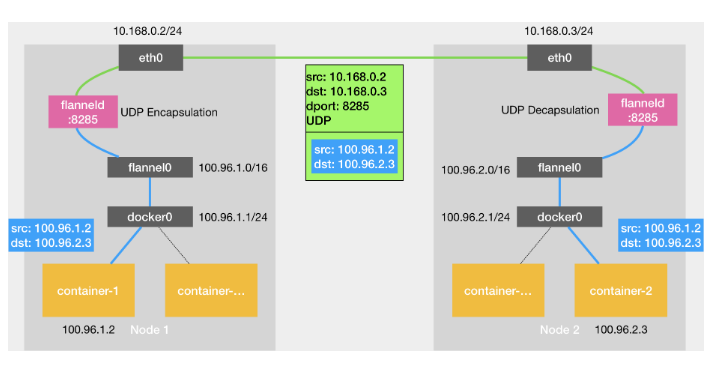
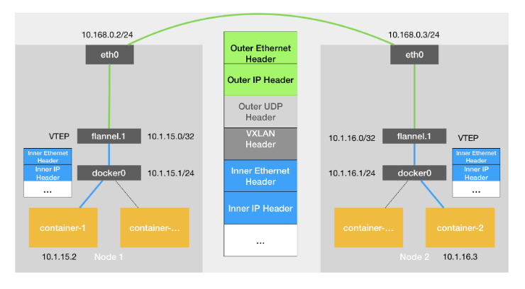

kube-proxy是pod和和service的代理

规划node,pod和sevice ip时要见名知意，就是根据实际得机房，项目，或者环境来规划ip可以更高效得管理及排障；
10.4.7.21
 4 机房
 7项目/环境 
 Flannel的UDP模型
 

Flannel的VxLAN模型

Flannel的host-gw模型

 

 flannel 的网络模型

 

 【网络策略】

 管控入站流量：
 networkpolicy
 范例：

apiVersion: networking.k8s.io/v1                                    #定义API版本
kind: NetworkPolicy                                                             #定义资源类型
metadata:   
    name: allow-myapp-ingress                                                 #定义NetwokPolicy的名字   
    namespace: default 
spec:                                                                                      #NetworkPolicy规则定义   
    podSelector:                                                                        #匹配拥有标签app:myapp的Pod资源     
        matchLabels:       
            app: myapp   
    policyTypes ["Ingress"]                                                      #NetworkPolicy类型，可以是Ingress，Egress，或者两者共存   
    ingress:         #定义入站规则   
    --  from:     
        -- ipBlock:                                                     #定义可以访问的网段         
            cidr: 10.244.0.0/16         
            except:                                                     #排除的网段        
            -- 10.244.3.0/24    
        -- podSelector:                                    #选定当前default名称空间，标签为app:myapp可以入站和ipblock一样是限制入站得一种规则类型         
                matchLabels:           
                    app: myapp     
        ports:                                                   #开放的协议和端口定义     
        -- protocol: TCP       
            port: 80    

该网络策略就是将default名称空间中拥有标签"app=myapp"的Pod资源开放80/TCP端口给10.244.0.0/16网段，并排除10.244.3.0/24网段的访问，并且也开放给标签为app=myapp的所有Pod资源进行访问。  

 管控出站流量：

 apiVersion: networking.k8s.io/v1
kind: NetworkPolicy
metadata:
  name: httpd-egress
spec:
  podSelector: 
    matchLabels:
      run: httpd
  policyTypes: ["Egress"]
  egress:
  \- to:
    \- podSelector:
        matchLabels:
          access: "true"
    ports:
    \- protocol: TCP
      port: 80
      
      
      该Egress规则，对标签run=httpd的Pod对象，到达标签为access=true的Pod对象的80端口的流量进行放行。

 
