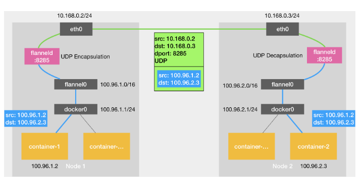
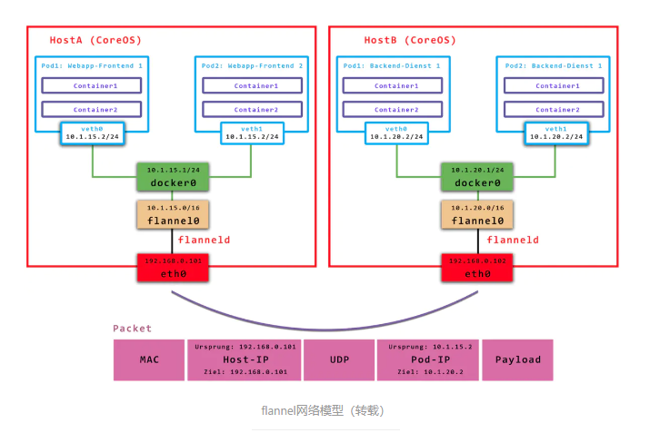

### Flannel

主要负责 Pod 网络的创建和管理。网络插件为 Pod 分配 IP 地址，确保同一个集群中的 Pod 可以互相通信，并实现网络隔离和策略控制

#### 网络模式

UDP 模式

VxLAN 模式(常用/默认）

host-gw 模式

### 网络模型

以下是关于 flannel 的详细解释

##### udp 模型

​		Node1上的container1(10.196.1.2)访问Node2上的container2(10.196.2.3),因为目的地址并不在Node1上的docker0网桥的网段里，
​		ip包会被交给默认路由规则（这个规则是安装flannel的时候flannel生成的），根据这个规则ip会进入到flannel0的设备，flanneld进程监测到有ip包到flannel0设备，
​		就会发现ip包的目标地址是10.196.2.3，flannel就会知道Node2的地址（node和子网的对应关系保存在etcd里面），然后把这个ip包封装到udp包里面发给node2的flannel监听的端口；
​		另一边的flanneld进程会做相反的操作，解封，将包发给flannel0设备，根据路由规则发送给container2;
​		upd 模型有严重的性能问题：
​			1、用户态和内核态数据的拷贝次数过多
​			（第一次<用户态进入内核态>进程发送数据到docker0,第二次<内核态进入用户态>flannel0传给flanneld进程，第三次<用户态进入内核态>flanneld封装后进入eth0）
​			2、flannel在用户态进行封装和解封
​			上述两种动作在linux代价比较大
​			

#####  host-gw 模型

​	Node1上的container1(10.196.1.2)访问Node2上的container2(10.196.2.3),当flannel使用host-gw模式之后，会在宿主机创建一条路由规则
​	<访问某个宿主机上pod网段内的ip,要经过eth0发送出去，下一条地址是目标pod所在的宿主机>，就会到达目标宿主机
​	到达宿目标主机的eth0后根据包的目的地址，根据路由规则，进入cni0网桥，从而到达目标pod
​	总结：host-gw模式的工作原理就是将每个flannel子网的下一跳，设置为其他子网对应的宿主机ip
​	FLannel host-gw模式必须要求集群宿主机之间是二层连通的

##### VxLAN 模型

​	Node1上的container1(10.196.1.2)访问Node2上的container2(10.196.2.3)，和udp一样根据路由规则通过docker0网桥进入flannel1设备，<这时的数据包称为原数据包>,
​	flannel1设备根据路由规则原数据包的下一跳地址目标宿主机上的flannel1设备；【将原数据包前面加目标flannel的mac:目标容器的地址】<目标flannel1设备的mac地址是在安装启动flannel时会在其他所有节点的arp表添加记录>
​	<【目标flannel的mac:目标容器的地址:原数据包】 称为内部数据帧>，然后linux内核将这个内部数据帧前面加VNI标识，然后封装到一个UDP包里面，
​	【目标主机的mac地址:目标主机的ip地址:udp header:VxLAN header[VNI]:目标flannel的mac:目标容器的地址:原数据包】，目标主机的mac地址也是flannel维护记录在FDB里；VNI=1<-->flannel1<识别flannel设备的标志位，都是1>
​	然后flannel1 从Node1的eth0发送到Node2的eth0,Node2的内核网络栈发现数据帧里面有VxLAN header 且VNI=1,然后就把包发送给flannel1设备；进行拆包，到达目标容器；
​	flannel1设备也就是VTEP设备惊醒封装和解封都是在内核里完成的<VxLAN就是内核的一个模块>，所以性能比udp好；
​	

用于宿主机不在同一个2层网络下，（如果宿主机在2层网络下，它可以启动直接路由（directrouting）和host-gw效果一样<此时流量不走flannel设备，走的是宿主机网关>）

SNAT规则
	优化flannel通过ipatables 非从docker0设备出，非目标ip为pod网络才进行snat转换	
	在集群内部，使用pod ip(让集群内部的容器互相看到真实的pod ip,不要使用node ip)，在外部可以使用宿主机ip

