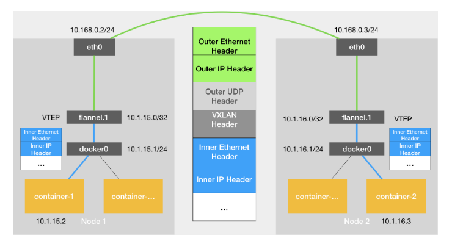
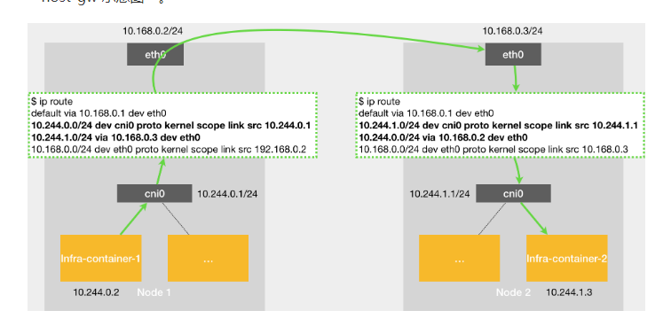

### Flannel

主要负责 Pod 网络的创建和管理。网络插件为 Pod 分配 IP 地址，确保同一个集群中的 Pod 可以互相通信，并实现网络隔离和策略控制

#### 网络模式

UDP 模式


VxLAN 模式(常用/默认）



host-gw 模式



### 网络模型


###  网络策略

示例

```
apiVersion: networking.k8s.io/v1
kind: NetworkPolicy
metadata:
  name: test-network-policy
  namespace: default
spec:
  podSelector:
    matchLabels:
      role: db
  policyTypes:
  - Ingress
  - Egress
  ingress:
  - from:
    - ipBlock:
        cidr: 172.17.0.0/16
        except:
        - 172.17.1.0/24
    - namespaceSelector:
        matchLabels:
          project: myproject
    - podSelector:
        matchLabels:
          role: frontend
    ports:
    - protocol: TCP
      port: 6379
  egress:
  - to:
    - ipBlock:
        cidr: 10.0.0.0/24
    ports:
    - protocol: TCP
      port: 5978
---
示例说明:

必需字段：与所有其他的 Kubernetes 配置一样，NetworkPolicy 需要 apiVersion、 kind 和 metadata 字段。关于配置文件操作的一般信息， 请参考配置 Pod 以使用 ConfigMap 和对象管理。

spec：NetworkPolicy 规约 中包含了在一个名字空间中定义特定网络策略所需的所有信息。

podSelector：每个 NetworkPolicy 都包括一个 podSelector， 它对该策略所适用的一组 Pod 进行选择。示例中的策略选择带有 "role=db" 标签的 Pod。 空的 podSelector 选择名字空间下的所有 Pod。

policyTypes：每个 NetworkPolicy 都包含一个 policyTypes 列表，其中包含 Ingress 或 Egress 或两者兼具。policyTypes 字段表示给定的策略是应用于进入所选 Pod 的入站流量还是来自所选 Pod 的出站流量，或两者兼有。 如果 NetworkPolicy 未指定 policyTypes 则默认情况下始终设置 Ingress； 如果 NetworkPolicy 有任何出口规则的话则设置 Egress。

ingress：每个 NetworkPolicy 可包含一个 ingress 规则的白名单列表。 每个规则都允许同时匹配 from 和 ports 部分的流量。示例策略中包含一条简单的规则： 它匹配某个特定端口，来自三个来源中的一个，第一个通过 ipBlock 指定，第二个通过 namespaceSelector 指定，第三个通过 podSelector 指定。

egress：每个 NetworkPolicy 可包含一个 egress 规则的白名单列表。 每个规则都允许匹配 to 和 port 部分的流量。该示例策略包含一条规则， 该规则将指定端口上的流量匹配到 10.0.0.0/24 中的任何目的地。

所以，该网络策略示例：

隔离 default 名字空间下 role=db 的 Pod （如果它们不是已经被隔离的话）。

（Ingress 规则）允许以下 Pod 连接到 default 名字空间下的带有 role=db 标签的所有 Pod 的 6379 TCP 端口：

default 名字空间下带有 role=frontend 标签的所有 Pod
带有 project=myproject 标签的所有名字空间中的 Pod
IP 地址范围为 172.17.0.0–172.17.0.255 和 172.17.2.0–172.17.255.255 （即，除了 172.17.1.0/24 之外的所有 172.17.0.0/16）
（Egress 规则）允许 default 名字空间中任何带有标签 role=db 的 Pod 到 CIDR 10.0.0.0/24 下 5978 TCP 端口的连接。
```

### 负载均衡

iptables 和 ipvs 负载均衡策略
可通过 kube-proxy 日志来查看使用的哪种代理模式 默认是 iptables
ipables 是随机选择后端
ipvs 支持多种策略 默认是轮询
sessionAffinity 可通过此参数 来绑定使客户端 ip 访问同一个pod