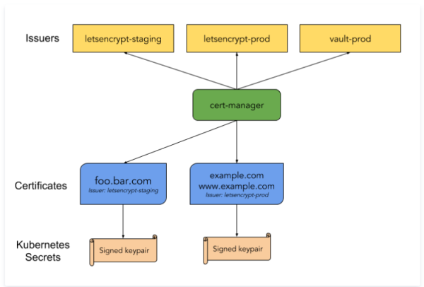

​     架构

cert-manager在k8s中定义了两个自定义类型资源：`Issuer`和`Certificate`

其中`Issuer`代表的是证书颁发者，可以定义各种提供者的证书颁发者，当前支持基于`Letsencrypt`、`vault`和`CA`的证书颁发者，还可以定义不同环境下的证书颁发者。
而`Certificate`代表的是生成证书的请求，一般其中存入生成证书的元信息，如域名等等。
一旦在k8s中定义了上述两类资源，部署的`cert-manager`则会根据`Issuer`和`Certificate`生成TLS证书，并将证书保存进k8s的`Secret`资源中，然后在`Ingress`资源中就可以引用到这些生成的`Secret`资源。对于已经生成的证书，还是定期检查证书的有效期，如即将超过有效期，还会自动续期。

配置cert-manager、issuer进行证书颁发
1、安装cert-manager
kubectl apply -f https://github.com/jetstack/cert-manager/releases/download/v1.0.0/cert-manager.yaml

root@bianJieBD-byg:~# cat clusterissuer-pro.yaml
apiVersion: cert-manager.io/v1
kind: ClusterIssuer
metadata:
  name: letsencrypt-production
spec:
  acme:
    \# You must replace this email address with your own.
    \# Let's Encrypt will use this to contact you about expiring
    \# certificates, and issues related to your account.
    email: devops@bianjie.ai
    server: https://acme-v02.api.letsencrypt.org/directory
    privateKeySecretRef:
      \# Secret resource that will be used to store the account's private key.
      name: newqa-secret
    \# Add a single challenge solver, HTTP01 using nginx
    solvers:
    \- http01:
        ingress:
          class: nginx

3、安装clusterissuer-staging(测试环境)
root@bianJieBD-byg:~#  cat clusterissuer.yaml
apiVersion: cert-manager.io/v1
kind: ClusterIssuer
metadata:
  name: letsencrypt-staging
spec:
  acme:
    \# You must replace this email address with your own.
    \# Let's Encrypt will use this to contact you about expiring
    \# certificates, and issues related to your account.
    email: devops@bianjie.ai
    server: https://acme-staging-v02.api.letsencrypt.org/directory
    privateKeySecretRef:
      \# Secret resource that will be used to store the account's private key.
      name: example-issuer-account-key
    \# Add a single challenge solver, HTTP01 using nginx
    solvers:
    \- http01:
        ingress:
          class: nginx

链接：
https://cert-manager.io/docs/
https://letsencrypt.org/zh-cn/