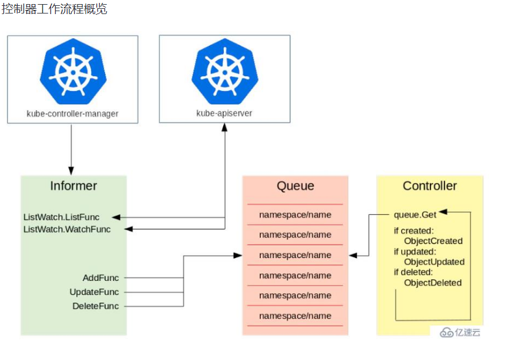

​         

如上图所示，左侧是一个 Informer，它的机制就是通过去 watch kube-apiserver，而 kube-apiserver 会去监督所有 etcd 中资源的创建、更新与删除。Informer 主要有两个方法：一个是 ListFunc；一个是 WatchFunc。
• ListFunc 就是像 "kuberctl get pods" 这类操作，把当前所有的资源都列出来；
• WatchFunc 会和 apiserver 建立一个长链接，一旦有一个新的对象提交上去之后，apiserver 就会反向推送回来，告诉 Informer 有一个新的对象创建或者更新等操作。
Informer 接收到了对象的需求之后，就会调用对应的函数（比如图中的三个函数 AddFunc, UpdateFunc 以及 DeleteFunc），并将其按照 key 值的格式放到一个队列中去，key 值的命名规则就是 "namespace/name"，name 就是对应的资源的名字。比如我们刚才所说的在 default 的 namespace 中创建一个 foo 类型的资源，那么它的 key 值就是 "default/example-foo"。Controller 从队列中拿到一个对象之后，就会去做相应的操作。

https://www.yisu.com/zixun/22252.html