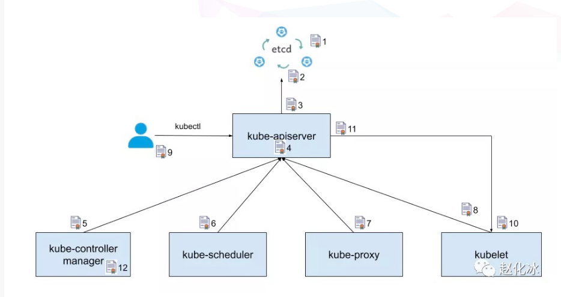
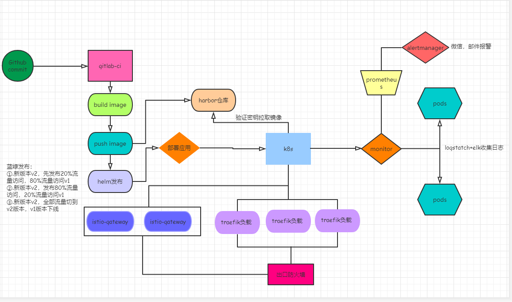
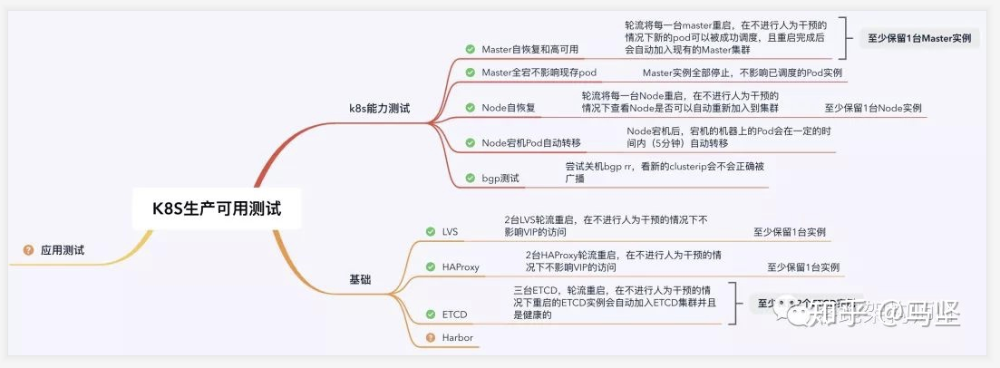
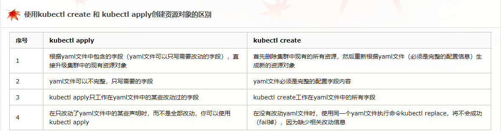

证书

Kubernetes 中使用到的主要证书
上图中使用序号对证书进行了标注。图中的箭头表明了组件的调用方向，箭头所指方向为服务提供方，另一头为服务调用方。为了实现 TLS 双向认证，服务提供方需要使用一个服务器证书，服务调用方则需要提供一个客户端证书，并且双方都需要使用一个 CA 证书来验证对方提供的证书。为了简明起见，上图中只标注了证书使用方提供的证书，并没有标注证书的验证方验证使用的 CA 证书。图中标注的这些证书的作用分别如下：
\1. etcd 集群中各个节点之间相互通信使用的证书。由于一个 etctd 节点既为其他节点提供服务，又需要作为客户端访问其他节点，因此该证书同时用作服务器证书和客户端证书。
\2. etcd 集群向外提供服务使用的证书。该证书是服务器证书。
\3. kube-apiserver 作为客户端访问 etcd 使用的证书。该证书是客户端证书。
\4. kube-apiserver 对外提供服务使用的证书。该证书是服务器证书。
\5. kube-controller-manager 作为客户端访问 kube-apiserver 使用的证书,该证书是客户端证书。
\6. kube-scheduler 作为客户端访问 kube-apiserver 使用的证书,该证书是客户端证书。
\7. kube-proxy 作为客户端访问 kube-apiserver 使用的证书,该证书是客户端证书。
\8. kubelet 作为客户端访问 kube-apiserver 使用的证书,该证书是客户端证书。
\9. 管理员用户通过 kubectl 访问 kube-apiserver 使用的证书,该证书是客户端证书。
\10. kubelet 对外提供服务使用的证书。该证书是服务器证书。
\11. kube-apiserver 作为客户端访问 kubelet 采用的证书。该证书是客户端证书。
\12. kube-controller-manager 用于生成和验证 service-account token 的证书。该证书并不会像其他证书一样用于身份认证，而是将证书中的公钥/私钥对用于 service account token 的生成和验证。kube-controller-manager 会用该证书的私钥来生成 service account token，然后以 secret 的方式加载到 pod 中。pod 中的应用可以使用该 token 来访问 kube-apiserver， kube-apiserver 会使用该证书中的公钥来验证请求中的 token。

围绕 kubernetes 的发布流程

kubernetes测试

