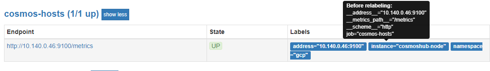

​         例如：

​    \- "job_name": "cosmos-hosts"                   #job name
​      "static_configs":                                    #静态配置
​      \- "targets": ["10.140.0.46:9100"]             #目标
​      "relabel_configs":                                  #标签配置
​      \- "source_labels": ["__address__"]           #源标签key
​        "target_label": "address"                      #目标标签key
​      \- "source_labels": ["__address__"]
​        "target_label": "namespace"
​        "replacement": "gcp"                           #替换的标签value
​      \- "source_labels": ["__address__"]
​        "target_label": "instance"
​        "regex": "10.140.0.46:9100"                #待匹配标签的value
​        "replacement": "cosmoshub-node"        #替换的标签value
​        
\# 总结：以上分为三中标签替换方式
​    1、根据原标签key只替换为新标签key
​    2、根据原标签key,替换成新标签key,且替换新标签的value(直接替换和原标签value是什么没关系)
​    3、根据原标签key,替换成新标签key,且根据原标签的value替换新标签的value（指定value替换的条件）
​    
​    标签不是一对一替换的，可以类似于添加标签/新增标签；
​     