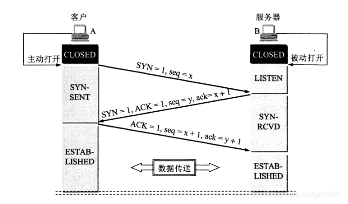
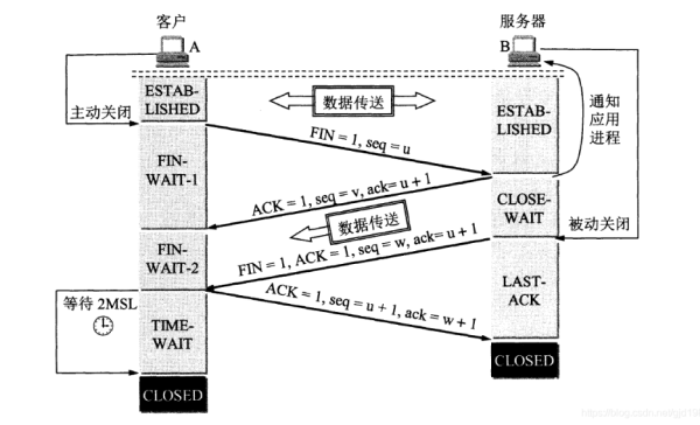

## 三次握手

1、A主动向B发起连接请求，发送SYN包（之后A进入SYN-SENT状态）
2、B收到之后即向A发送ACK包与自己的SYN包（之后B进入SYN-RCVD状态）
3、A收到B的ACK包和SYN包即也发送ACK包（之后A进入ESTAB-LISHED状态，B收到A的ACK包之后也进入ESTAB-LISHED状态）

## 四次挥手

1、A主从发起断开连接请求，向B发送FIN包(之后进入FIN-WAIT-1状态)
2、B收到A发来的FIN包之后，向A发送ACK包（之后B进入CLOSE-WAIT）,A收到B发来的ACK包之后就进入到FIN-WAIT-2状态
3、B也向A发起断开连接请求，向A发送FIN包(之后进入LAST-ACK状态)
4、A收到B发来的FIN包，即向B发送ACK包（之后A进入TIME-WAIT状态，等待2MSL之后进入CLOSED状态，释放连接），B收到A的ACK包之后就进入CLOSED状态，释放连接了；

注意：
1、主动发起方的TIME-WAIT状态是为了防止发起方 向 被动方 发送的ACK包丢失导致被动方无法正常释放连接，所以要等2MSL时间；
2、RST包用于强制关闭TCP链接。（比如四次挥手时到某个步骤发生了问题，机会导致某一方发送RST包来释放连接）
参考：
https://blog.csdn.net/hkhl_235/article/details/79721645
https://blog.csdn.net/hik_zxw/article/details/50167703