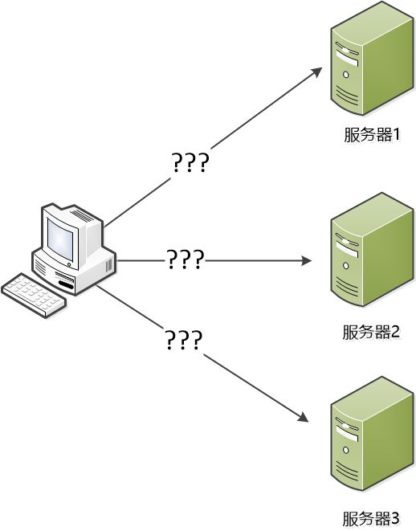
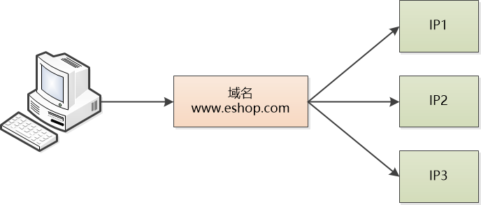
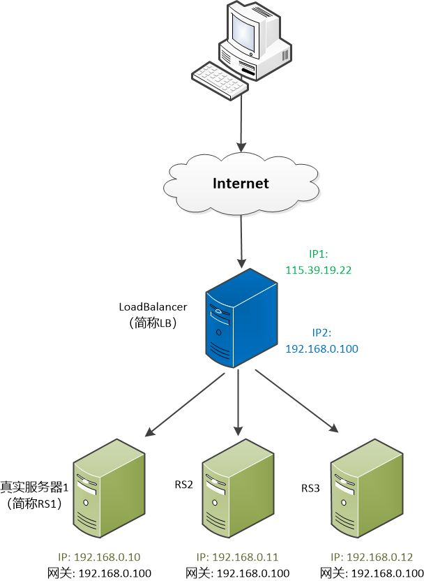
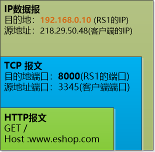
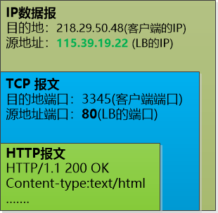
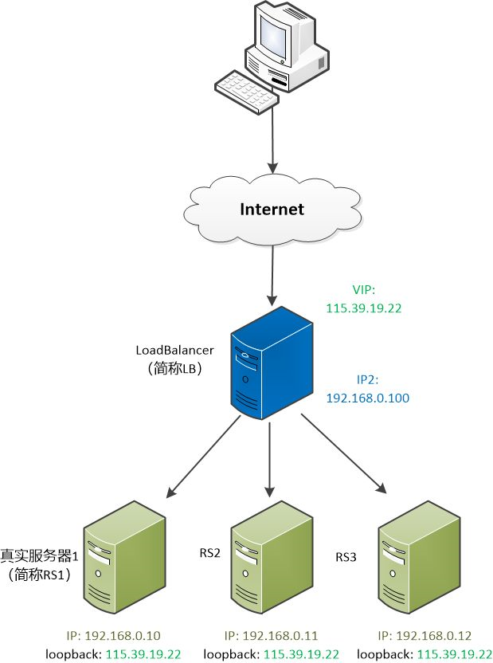
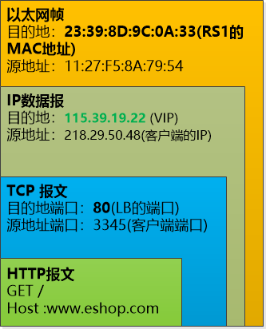

# 负载均衡的原理 

这是1998年一个普通的上午。

一上班，老板就把张大胖叫进了办公室，一边舒服地喝茶一边发难：“大胖啊，我们公司开发的这个网站，现在怎么越来越慢了？ ”

还好张大胖也注意到了这个问题，他早有准备，一脸无奈地说： “唉，我昨天检查了一下系统，现在的访问量已经越来越大了，无论是CPU，还是硬盘、内存都不堪重负了，高峰期的响应速度越来越慢。”

顿了一下，他试探地问道：“老板，能不能买个好机器？ 把现在的‘老破小’服务器给替换掉。我听说IBM的服务器挺好的，性能强劲，要不来一台？”

（码农翻身注：这叫垂直扩展 Scale Up）

“好你个头，你知道那机器得多贵吗？! 我们小公司，用不起啊！” 抠门的老板立刻否决。

“这......” 大胖表示黔驴技穷了。

“你去和CTO Bill 商量下， 明天给我弄个方案出来。”

老板不管过程，只要结果。

1隐藏真实服务器

大胖悻悻地去找Bill。

他将老板的指示[声情并茂](https://www.baidu.com/s?wd=声情并茂&tn=24004469_oem_dg&rsv_dl=gh_pl_sl_csd)地做了传达。

Bill笑了：“我最近也在思考这件事，想和你商量一下，看看能不能买几台便宜的服务器，把系统多部署几份，横向扩展(Scale Out)一下。 ”

横向扩展？ 张大胖心中寻思着，如果把系统部署到几个服务器上，用户的访问请求就可以分散到各个服务器，那单台服务器的压力就小得多了。

“可是，” 张大胖问道 ，“机器多了，每个机器一个IP， 用户可能就迷糊了，到底访问哪一个？”

“肯定不能把这些服务器暴露出去，从客户角度看来，最好是只有一个服务器。” Bill 说道。

张 大胖眼前一亮， 突然有了主意：“有了！我们有个中间层啊，对，就是DNS，我们可以设置一下，让我们网站的域名映射到多个服务器的IP，用户面对的是我们系统的域名，然 后我们可以采用一种轮询的方式， 用户1的机器做域名解析的时候，DNS返回IP1, 用户2的机器做域名解析的时候，DNS返回IP2...... 这样不就可以实现各个机器的负载相对均衡了吗？”

Bill 思考片刻，发现了漏洞：“这样做有个很要命的问题，由于DNS这个分层的系统中有缓存，用户端的机器也有缓存，如果某个机器出故障，域名解析仍然会返回那个出问题机器的IP，那所有访问该机器的用户都会出问题， 即使我们把这个机器的IP从DNS中删除也不行， 这就麻烦了。”

张大胖确实是没想到这个缓存带来的问题， 他挠挠头：“那就不好办了。”

2偷天换日

“要不我们自己开发一个软件实现负载均衡怎么样？” Bill另辟蹊径。

为了展示自己的想法， 他在白板上画了一张图， “看到中间那个蓝色服务器没有，我们可以把它称为Load Balancer （简称LB）， 用户的请求都发给他，然后它再发给各个服务器。”

张大胖仔细审视这个图。

Load Balancer 简称LB ， 有两个IP，一个对外（115.39.19.22），一个对内(192.168.0.100)。用户看到的是那个对外的IP。 后面的真正提供服务的服务器有三个，称为RS1, RS2,RS3， 他们的网关都指向LB。

“但是怎么转发请求呢？嗯， 用户的请求到底是什么东西？”  张大胖迷糊了。
“你 把计算机网络都忘了吧？ 就是用户发过来的数据包嘛！ 你看这个层层封装的数据包，用户发了一个HTTP的请求，想要访问我们网站的首页，这个HTTP请求被放到一个TCP报文中，再被放到一个IP数据报中， 最终的目的地就是我们的Load Balancer（115.39.19.22）。”

（注： 客户发给LB的数据包， 没有画出数据链路层的帧）

“但是这个数据包一看就是发给Load Balancer的， 怎么发给后面的服务器？”

Bill 说： “可以偷天换日，比如Load Balancer想把这个数据包发给RS1（192.168.0.10）, 就可以做点手脚，把这个数据包改成这样， 然后这个IP数据包就可以转发给RS1去处理了。”

（LB动了手脚，把目的地IP和端口改为RS1的）

“RS1处理完了，要返回首页的HTML，还要把HTTP报文层层封装：” 张大胖明白怎么回事了：

（RS1处理完了，要发送结果给客户端）

“由于LB是网关，它还会收到这个数据包，它就可以再次施展手段，把源地址和源端口都替换为自己的，然后发给客户就可以了。”

(LB再次动手脚，把源地址和端口改成自己的， 让客户端毫无察觉)

张大胖总结了一下数据的流向：
客户端 --> Load Balancer --> RS --> Load Balancer --> 客户端

他兴奋地说：“这招瞒天过海真是妙啊，客户端根本就感受不到后面有好几台服务器在工作，它一直以为只有Load Balancer在干活。”

Bill此刻在思考Load Balancer 怎么样才能选取后面的各个真实的服务器， 可以有很多种策略，他在白板上写到：

轮询： 这个最简单，就是一个挨一个轮换。
加权轮询： 为了应对某些服务器性能好，可以让他们的权重高一点，被选中的几率大一点。
最少连接： 哪个服务器处理的连接少，就发给谁。
加权最少连接：在最少连接的基础上，也加上权重
......
还有些其他的算法和策略，以后慢慢想。

3四层还是七层？

张大胖却想到了另外一个问题： 对于用户的一个请求来说，可能会被分成多个数据包来发送， 如果这些数据包被我们的Load Balancer发到了不同的机器上，那就完全乱套了啊！  他把自己的想法告诉了Bill。

Bill说：“这个问题很好啊，我们的Load Balancer必须得维护一个表，这个表需要记录下客户端的数据包被我们转发到了哪个真实的服务器上， 这样当下一个数据包到来时，我们就可以把它转发到同一个服务器上去。”

“看来这个负载均衡软件需要是面向连接的，也就是OSI网络体系的第4层， 可以称为四层负载均衡”Bill做了一个总结。

“既然有四层负载均衡，那是不是也可以搞个七层的负载均衡啊？” 张大胖突发奇想。

“那是肯定的，如果我们的Load Balancer把HTTP层的报文数据取出来，根据其中的URL，浏览器，语言等信息，把请求分发到后面真实的服务器去，那就是七层的负载均衡了。不过我们现阶段先实现一个四层的吧，七层的以后再说。”

Bill 吩咐张大胖组织人力把这个负载均衡软件给开发出来。
张大胖不敢怠慢，由于涉及到协议的细节问题，张大胖还买了几本书：[《TCP/IP详解》](https://www.baidu.com/s?wd=《TCP%2FIP详解》&tn=24004469_oem_dg&rsv_dl=gh_pl_sl_csd) 卷一,卷二,卷三， 带着人快速复习了C语言， 然后开始疯狂开发。

4责任分离

三个月后，Load Balancer的第一版开发出来了，这是运行在Linux上的一个软件， 公司试用了一下，感觉还真是不错，仅仅用几台便宜的服务器就可以实现负载均衡了。

老板看到没花多少钱就解决了问题，非常满意，给张大胖所在的开发组发了1000块钱奖金，组织大家出去搓了一顿。

张大胖他们看到老板很抠门，虽略有不满，但是想到通过这个软件的开发，学到了很多底层的知识，尤其是TCP协议，也就忍了。

可是好景不长，张大胖发现这个Load Balancer存在这瓶颈：所有的流量都要通过它，它要修改客户发来的数据包， 还要修改发给客户的数据包。

网络访问还有个极大的特点，那就是请求报文较短而响应报文往往包含大量的数据。这是很容易理解的，一个HTTP GET请求短得可怜，可是返回的HTML却是极长 -- 这就进一步加剧了Load Balancer修改数据包的工作。

张大胖赶紧去找Bill ，Bill说：“这确实是个问题，我们把请求和响应分开处理吧，让Load Balancer只处理请求，让各个服务器把响应直接发给客户端，这样瓶颈不就消除了吗？”

“怎么分开处理？”

“首先让所有的服务器都有同一个IP， 我们把他称为VIP吧（如图中115.39.19.22）。”

张大胖通过第一版Load Balancer的开发，积累了丰富的经验。

他问道：“你这是把每个实际服务器的loopback都绑定了那个VIP， 不过有问题啊，这么多服务器都有同样的IP , 当IP数据包来的时候，到底应该由哪个服务器来处理？”

“注意，IP数据包其实是通过数据链路层发过来的，你看看这个图。”

张大胖看到了客户端的HTTP报文再次被封装储层TCP报文，端口号是80， 然后IP数据报中的目的地是115.39.19.22(VIP)。

图中的问号是目的地的MAC地址， 该怎么得到呢？

对， 是使用ARP协议，把一个IP地址（115.39.19.22）给广播出去，然后具有此IP机器就会回复自己的MAC地址。 但是现在有好几台机器都有同一个IP（115.39.19.22）， 怎么办？

Bill 说道：“我们只让Load Balancer 响应这个VIP地址（115.39.19.22）的ARP请求，对于RS1,RS2,RS3, 抑制住对这个VIP地址的ARP响应，不就可以唯一地确定Load Balancer了？ ”

原来如此！张大胖恍然大悟。

既然Load Balancer得到了这个IP数据包， 它就可以用某个策略从RS1, RS2,RS3中选取一个服务器，例如RS1（192.168.0.10），把IP数据报原封不动， 封装成数据链路层的包（目的地是RS1的MAC地址），直接转发就可以了。

RS1（192.168.0.10）这个服务器收到了数据包，拆开一看，目的地IP是115.39.19.22，是自己的IP， 那就可以处理了。

处理完了以后，RS1可以直接响应发回给客户端，完全不用再通过Load Balancer。因为自己的地址就是115.39.19.22。

对于客户端来说，它看到的还是那个唯一的地址115.39.19.22， 并不知道后台发生了什么事情。

Bill补充到：“由于Load Balancer 根本不会修改IP数据报，其中的TCP的端口号自然也不会修改，这就要求RS1, RS2,RS3上的端口号必须得和Load Balancer一致才行。”

像之前一样，张大胖总结了一下数据的流向：

客户端 --> Load Balancer --> RS --> 客户端

Bill 说道：“怎么样？ 这个办法还可以吧？”

张大胖又想了想，这种方式似乎没有漏洞，并且效率很高，Load Balancer只负责把用户请求发给特定的服务器就万事大吉了， 剩下的事由具体的服务器来处理，和它没有关系了。

他高兴地说：“不错，我着手带人去实现了。”

后记： 本文所描述的，其实就是著名开源软件LVS的原理，上面讲的两种负载均衡的方式，就是LVS的NAT和DR。

LVS是章文嵩博士在1998年5月成立的自由软件项目，现在已经是Linux内核的一部分。想想那时候我还在[不亦乐乎](https://www.baidu.com/s?wd=不亦乐乎&tn=24004469_oem_dg&rsv_dl=gh_pl_sl_csd)地折腾个人网页，学会安装和使用Linux 没多久 , 服务器端开发也仅限于ASP，像LVS这种负载均衡的概念压根就没有听说过。 

编程语言可以学，差距也能弥补，但是这种境界和眼光的差距，简直就是巨大的鸿沟，难以跨越啊！